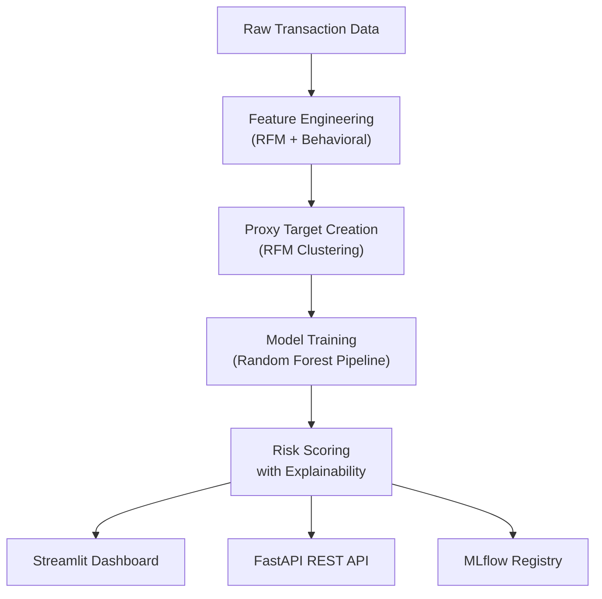
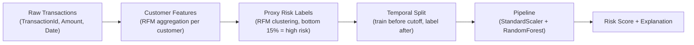

# Mobile Money Credit Scoring: Alternative Credit for Ethiopia's Unbanked

[](https://github.com/hann2004/credit-risk-model/actions/workflows/ci.yml)
[](https://www.python.org/)
[](https://pandas.pydata.org/)
[](https://scikit-learn.org/)
[](https://opensource.org/licenses/MIT)


## 🎯 The Problem

**Millions of Ethiopians have mobile money accounts but no formal credit score.** 

- 📱 **40M+ mobile money users** in Ethiopia (Telebirr, M-Birr, Ethiotelecom)
- 🚫 **Zero formal credit history** - no access to bank loans or microfinance
- 💼 Small traders, gig workers, and merchants locked out of credit systems
- 🏦 Microfinance institutions have no way to assess creditworthiness beyond collateral

**Result**: Billions in lending capacity goes untapped. Billions in productive potential remains unrealized.

## ✨ Our Solution

EqubScore uses mobile money behavioral patterns to generate an explainable risk score for Equb applicants. The system analyzes:

- Transaction frequency (how often someone uses mobile money)
- Monetary volume (total and average transaction amounts)
- Payment consistency (how stable the amounts are over time)
- Channel and product category patterns

No bank account or formal credit history required. The model produces a probability score with an explanation of which factors drove it.

---

## System Architecture

### System Overview



### Data Pipeline



---

## Model Performance

The production model is a `Pipeline(StandardScaler, RandomForestClassifier)` trained on customer-level RFM features derived from the Xente mobile money dataset (Uganda, used as a proxy).

| Metric | Value |
|---|---|
| ROC-AUC | 0.923 |
| Precision | 0.593 |
| Recall | 0.848 |
| F1 Score | 0.698 |
| Test Coverage | 78% |

The model prioritizes recall -- it is better to flag a borderline applicant for review than to silently approve someone who defaults.

### Important Disclaimer

This model was trained on Ugandan mobile money data (Xente/Kaggle) as a proxy to demonstrate technical feasibility. Transaction behavioral patterns (frequency, volume, consistency) are universal across mobile money platforms, but the model has not been validated on Ethiopian data yet. Retraining on TeleBirr or CBE Birr data is the planned next step before any real deployment.

This system is a decision support tool. It is not a replacement for the organizer's judgment.

---

## Quick Start

### Prerequisites

- Python 3.11+
- Git

### Setup

```bash
git clone https://github.com/hann2004/credit-risk-model.git
cd credit-risk-model
python3 -m venv .venv
source .venv/bin/activate
pip install -r requirements.txt
```

### Run the Dashboard

```bash
streamlit run app/dashboard_v2.py
```

Opens at `http://localhost:8501`. The dashboard loads a pre-trained model and sample Equb applicant profiles. No data preparation needed to try it.

### Run the API

```bash
uvicorn src.api.main:app --host 0.0.0.0 --port 8000
```

Health check:
```bash
curl http://localhost:8000/health
```

Score a customer:
```bash
curl -X POST http://localhost:8000/predict \
    -H "Content-Type: application/json" \
    -d '{"instances": [{"txn_count": 45, "avg_amount": 1200, "total_amount": 54000, "std_amount": 300}]}'
```

### Run with Docker

```bash
docker-compose up
```

---

## Demo

See the dashboard and model explainability in action:


---

## Data Processing

If you have raw transaction data and want to rebuild the labeled dataset:

```bash
# Build customer-level features from raw transactions
python -m src.data_processing

# Add RFM-based proxy risk labels
python -m src.data_processing --with-target

# Build with temporal split (recommended -- reduces leakage)
python -m src.data_processing --temporal-cutoff 2018-11-01 --outcome-days 30
```

## Model Training

```bash
python -m src.train
```

This trains both Logistic Regression and Random Forest, logs both to MLflow, selects the best by ROC-AUC, and saves to `models/production_model.pkl`.

View experiment history:
```bash
mlflow ui
```

---

## How the Risk Label is Built

The target variable `is_high_risk` is derived from RFM (Recency, Frequency, Monetary) behavioral scoring -- not from fraud labels.

```
risk_score = scaled_recency - scaled_frequency - scaled_monetary
```

Customers with high recency (inactive), low frequency, and low monetary volume get the highest risk scores. The top 15% by risk score are labeled `is_high_risk = 1`.

This is the standard methodology used by alternative credit scoring systems (Branch, Jumo, M-Shwari) when no historical default data is available.

---

## Project Structure

```
credit-risk-model/
├── src/
│   ├── data/
│   │   ├── features.py       # Customer-level feature engineering
│   │   ├── rfm.py            # RFM computation and cluster selection
│   │   ├── proxy_target.py   # RFM-to-label conversion
│   │   └── temporal.py       # Time-aware dataset splitting
│   ├── api/
│   │   ├── main.py           # FastAPI endpoints
│   │   └── pydantic_models.py
│   ├── data_processing.py    # Pipeline entry point
│   ├── train.py              # Model training with MLflow
│   ├── predict.py            # Inference utilities
│   ├── explainability.py     # SHAP analysis
│   ├── config.py             # Training configuration
│   └── constants.py          # Paths and defaults
├── app/
│   ├── dashboard_v2.py       # Active Streamlit dashboard (Equb questionnaire UI)
│   └── streamlit_app.py      # Alternate dashboard variant
├── tests/
│   ├── test_pipeline.py
│   ├── test_predict.py
│   ├── test_proxy_target.py
│   ├── test_temporal.py
│   └── conftest.py
├── models/
│   ├── production_model.pkl
│   └── production_model_info.json
├── data/
│   ├── raw/data.csv
│   └── processed/
├── reports/figures/          # SHAP plots, dashboard screenshots
├── notebooks/eda.ipynb
├── docker-compose.yml
└── README.md
```

---

## Running Tests

```bash
pytest tests/ -v
```

12 tests, 100% passing (1 skipped). Tests cover the feature pipeline, proxy target construction, temporal splitting, and model inference.

---

## Roadmap

**Phase 1 (Months 1-3):** Partner with TeleBirr or CBE Birr for Ethiopian transaction data. Retrain on local patterns. Validate that RFM signals translate correctly.

**Phase 2 (Months 4-6):** Pilot with 3-5 real Equb groups in Arba Minch. Measure actual default rate impact. Collect organizer feedback and iterate.

**Phase 3 (Months 7-12):** Scale to 20+ groups. Build Amharic language interface. Explore microfinance institution partnerships.

---

## Author

Hanan Nasir -- Third Year Software Engineering, Arba Minch University

hanan.nasir1209@gmail.com

## License

MIT License
    ├── app/
    │   ├── dashboard_v2.py       # Active Streamlit dashboard (Equb questionnaire UI)
    │   └── streamlit_app.py      # Alternate dashboard variant
    ├── tests/
    │   ├── test_pipeline.py
    │   ├── test_predict.py
    │   ├── test_proxy_target.py
    │   ├── test_temporal.py
    │   └── conftest.py
    ├── models/
    │   ├── production_model.pkl
    │   └── production_model_info.json
    ├── data/
    │   ├── raw/data.csv
    │   └── processed/
    ├── reports/figures/          # SHAP plots, dashboard screenshots
    ├── notebooks/eda.ipynb
    ├── docker-compose.yml
    ├── requirements.txt
    └── README.md
    ```

    ---

    ## Running Tests

    ```bash
    pytest tests/ -v
    ```

    12 tests, 100% passing (1 skipped). Tests cover the feature pipeline, proxy target construction, temporal splitting, and model inference.

    ---

    ## Roadmap

    **Phase 1 (Months 1-3):** Partner with TeleBirr or CBE Birr for Ethiopian transaction data. Retrain on local patterns. Validate that RFM signals translate correctly.

    **Phase 2 (Months 4-6):** Pilot with 3-5 real Equb groups in Arba Minch. Measure actual default rate impact. Collect organizer feedback and iterate.

    **Phase 3 (Months 7-12):** Scale to 20+ groups. Build Amharic language interface. Explore microfinance institution partnerships.

    ---

    ## Author

    Hanan Nasir -- Third Year Software Engineering, Arba Minch University

    hanan.nasir1209@gmail.com

    ## License

    MIT License

