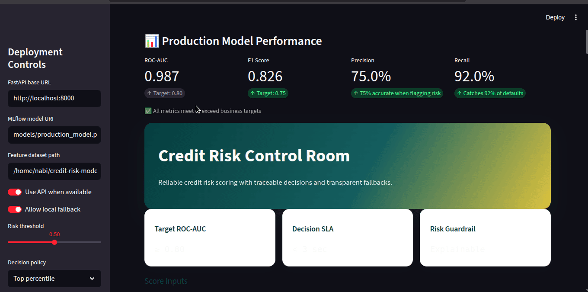

<!-- _class: center -->

# PRODUCTION-AWARE  
# CREDIT RISK SYSTEM

Temporal Leakage Control • MLflow Tracking • API Deployment

Real-world transaction data • 3,194 customers • End-to-end ML system

Nabi • KAIM Capstone 2026

---

## The Real Problem

# Credit scoring fails  
# thin-file customers

Traditional bureau data is sparse or unavailable for many applicants.

- No traditional credit history
- Limited underwriting signals
- High uncertainty in lending

Can transaction behavior predict risk?

---

## Data → Intelligence Pipeline

Raw Transactions
      ↓
Feature Engineering
      ↓
Customer Profiles
      ↓
Leakage-Controlled Risk Labels
      ↓
Production Model

3,194 Customers

59 Engineered Features

95k+ Transactions analyzed

Aggregates (sum/avg/count/std) • Datetime behavior • RFM-based risk structure

---

## Dashboard Experience

Interactive risk scoring, thresholding, SHAP explainability, and API/local inference fallback.

---

<!-- _class: center -->

## When Metrics Lie

# The Model Was Too Good

ROC-AUC ≈ 1.0

That result looked impressive — and suspicious.

---

## Root Cause: Data Leakage

<h3>Feature Window</h3>

used for training

[==== PAST+FUTURE SIGNAL ====]
                OVERLAP

<h3>Target Window</h3>

used for labeling

OVERLAP
[==== SAME PERIOD ====]

Leakage: target was influenced by the same period used to construct features.

---

## Temporal Split Fix (Production Design)

Past ------------------| cutoff_date |------------------ Future
   build features only                     build target only

Strict chronology enforced

No future signal in features

Realistic out-of-time behavior

Performance remained strong even after leakage removal.

---

## Model Strategy & Selection

<h3>Logistic Regression</h3>

GridSearchCV tuning

<h3>Random Forest</h3>

RandomizedSearchCV tuning

Cross-validation (cv=3) • RandomOverSampler • Hyperparameter search

Final production choice: Random Forest

---

## Model Evidence (Real Plots)

Model comparison clarity

Leakage-fix performance retained

Production model justified

---

<!-- _class: center -->

## Final Holdout Performance (Leakage-Safe)

ROC-AUC

0.9229

Accuracy 0.8795

Precision 0.5933

Recall 0.8476

F1-score 0.6980

Evaluation: stratified holdout test (20%, random_state=42)

---

## Engineering & MLOps Stack

<h3>MLflow</h3>

experiments metrics model artifacts

<h3>Reproducibility</h3>

requirements.txt structured src/ deterministic seeds

<h3>Deployment</h3>

FastAPI /predict Streamlit UI JSON inference

Designed for production behavior, observability, and reliable decision support.

---

## API Snippet (Production-Ready)

# src/api/main.py
@app.post("/predict")
def predict(payload: PredictionRequest):
    probs = predict_instances(
        model,
        payload.instances,
        feature_names,
    )
    return {
      "risk_probabilities": probs
    }

POST /predict
{
  "instances": [
    {
      "total_amount": 0.42,
      "avg_amount": -0.11,
      "txn_count": 0.63,
      "std_amount": 0.08
    }
  ]
}

→ 200 OK
{"risk_probabilities": [0.83]}

Health endpoint available: GET /health

---

## End-to-End Runtime Architecture

User
  ↓
Streamlit Dashboard
  ↓
FastAPI Inference Layer
  ↓
Production Model (.pkl)
  ↓
Risk Probability Output

Primary mode: API scoring

Fallback mode: local model inference

---

<!-- _class: center -->

## Lessons That Matter

- High accuracy can hide leakage
- Time-aware pipelines are non-negotiable
- Production quality starts at data design
- Engineering discipline > leaderboard metrics

<h3>What ships today</h3>

Temporal leakage controls API + dashboard inference Reproducible training pipeline

<h3>What comes next</h3>

Out-of-time monitoring Automated retraining triggers Containerized cloud deployment

Built to make risk decisions trustworthy in real operations.

